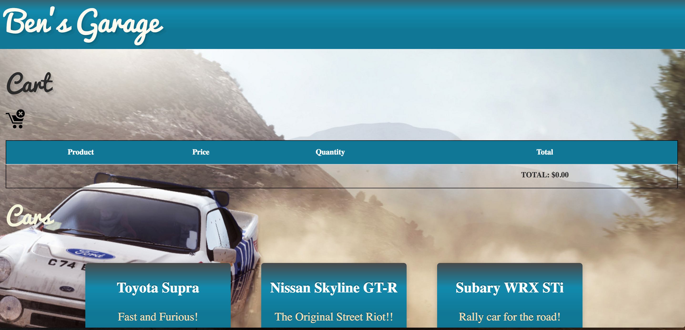
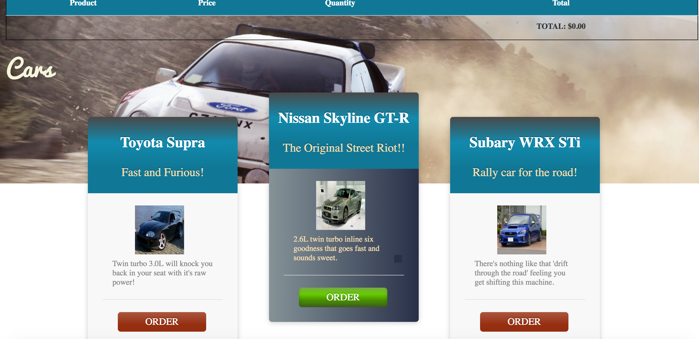

# React/Redux Car Checkout
A car checkout site using React with Redux.

Please note that this site is a sandbox for React and Redux and I'm constantly adding improvements and testing different features in this site.

##Screenshots:
Ben's Garage - 1: 


Ben's Garage - 2: 



##Instructions:
1. Clone git repository and run ```npm install``` and ```gulp``` to start webpack dev server.
2. Navigate to ```http://localhost:4000/public/``` in order to launch the site.
